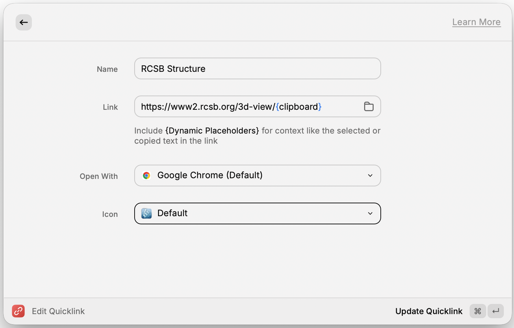
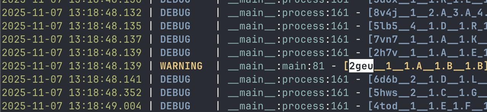
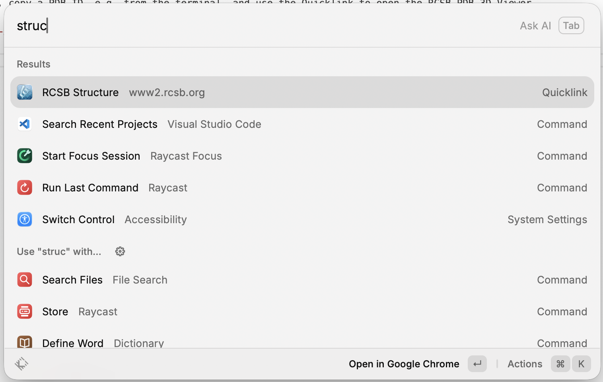

# Use Raycast Quicklinks to open RCSB PDB 3D Viewer

1. Create a [Raycast Quicklink](https://www.raycast.com/core-features/quicklinks) with the following content:
```
Name: RCSB Structure
Link: https://www2.rcsb.org/3d-view/{clipboard}
```



2. With it, copy a PDB ID, e.g. from the terminal, and use the Quicklink to open the RCSB PDB 3D Viewer.



3. Open Raycast, search for the Quicklink "RCSB Structure", and hit enter.



4. https://www2.rcsb.org/3d-view/2GEU opens in your browser of choice.

5. Repeat with "https://www.rcsb.org/ligand/{clipboard}" for RCSB Ligand Viewer Quicklink where a CCD code is copied to the clipboard.